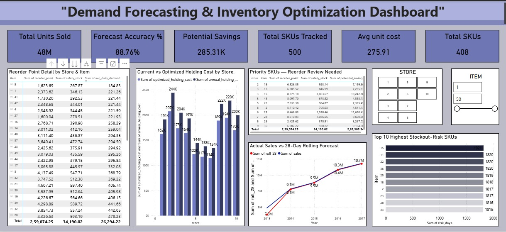

# Demand-Forecasting-Inventory-Optimization-Dashboard
Data Analytics project forecasting SKU-level retail demand and optimizing inventory using SQL, Python, Excel, and Power BI.
Performed demand forecasting, safety stock and reorder point calculation, stockout risk detection, and created an executive
dashboard to quantify inventory holding cost savings.

## Project Overview

This project presents an end‑to‑end demand forecasting and inventory optimization analysis conducted on a retail sales 
dataset using the Kaggle **Store Item Demand Forecasting Challenge** dataset.
The objective was to forecast demand at the SKU level, calculate optimal safety stock and reorder points, identify 
which SKUs carry the highest stockout risk, and quantify the cost savings available from optimizing current inventory levels.
The project combines Python for forecasting, SQL for inventory logic, Excel for an interactive planning tool, and Power BI 
for executive‑level dashboard storytelling.

---

## Business Problem

A retail operation carrying 500 SKUs across 10 stores needs to decide how much stock to hold for each item, and when to reorder it.
Holding too little risks stockouts and lost sales. Holding too much ties up cash in unnecessary holding costs.

**Primary Question:**  
Which SKUs are at the highest risk of stockout, and how much could be saved by optimizing current safety stock levels?

---

## Data Scope

- Stores: 10  
- Items: 50  
- Total SKU Combinations: 500  
- Daily Sales Records: ~913,000  
- Date Range: 2013 – 2017  

The dataset provides sales history only. Inventory-specific fields such as lead time and unit cost are not available in 
any public retail dataset, so these were simulated using realistic ranges and industry-standard formulas, stated here 
directly rather than presented as measured data.

---

## Tools & Technologies

- SQL (SQLite in Google Colab)
- Python (Pandas, NumPy, Scikit-learn)
- Forecasting (Linear Regression on rolling demand features)
- Inventory Formulas (Safety Stock, Reorder Point, Holding Cost)
- Excel (Interactive Reorder Simulator)
- Power BI (Dashboard Design & Storytelling)

---

## Data Preparation

The following preprocessing and feature engineering steps were performed:

- Verified no missing values across 913,000 sales records
- Engineered calendar features (month, day of week)
- Calculated 7-day and 28-day rolling sales averages per store-item pair as demand signals
- Simulated lead time, unit cost, and holding cost percentage per SKU
- Stored cleaned dataset in SQL for querying

---

## Forecasting & Inventory Logic

A linear regression model was trained per store-item combination using calendar features and rolling averages, rather than a single model across all SKUs, to capture item-specific demand patterns.

Safety stock was calculated using the standard formula:

**Safety Stock = Z-score × Demand Standard Deviation × √(Lead Time)**

Reorder point was derived as:

**Reorder Point = (Average Daily Demand × Lead Time) + Safety Stock**

Stockout risk was flagged in SQL by comparing a rolling sum of sales over each SKU's lead-time window against its reorder point, using window functions. An earlier version of this logic compared single-day sales directly against the multi-day reorder threshold, which under-flagged risk almost entirely — correcting this to a lead-time-adjusted rolling comparison was a necessary fix, not a stylistic choice.

---

## Key Results

### Forecast Accuracy

- Average Forecast Accuracy across 500 SKUs: **88.76%**

### Stockout Risk

- High-Risk SKU Count: **408**
- Risk is concentrated in a small subset of store-item combinations rather than spread evenly across the catalog

### Inventory Cost Optimization

- Average Unit Cost: **275.91**
- Total Units Sold (period): **48M**
- Potential Annual Holding Cost Savings (15% safety stock optimization): **285.31K**

---

## Statistical & Analytical Approach

Rather than using a single complex forecasting model, a straightforward linear regression on rolling averages and calendar features was used per SKU. This was a deliberate choice — a simple, explainable model that performs well is more defensible in a business setting than a marginally more accurate model nobody can interpret or justify to a non-technical stakeholder.

The 15% safety stock reduction used to estimate cost savings is a planning assumption based on the reorder point calculations, not a guaranteed outcome, and would need validation against real supply chain constraints before being applied operationally.

---

## Business Interpretation

Although the dataset provides sales history only, the reorder point and safety stock framework applied here reflects standard inventory planning logic used in real operations. The 408 SKUs flagged as high-risk represent a manageable subset of the full 500-SKU catalog, meaning a procurement team could realistically prioritize review of this group rather than treating every SKU with a uniform reorder policy.

The potential savings of 285.31K are not evenly distributed — they are driven by a smaller number of high-cost, high-safety-stock SKUs, which is itself an actionable insight: targeted optimization on a subset of items delivers most of the value, rather than requiring a blanket policy change across the catalog.

---

## Final Recommendation

Prioritize reorder point review for the top 10 highest-risk SKUs identified in the dashboard, and pilot the 15% safety stock reduction on the highest-cost items first to validate real-world savings before rolling it out catalog-wide.

Recommended next steps:

- Validate simulated lead time and unit cost assumptions against real supplier data
- Pilot safety stock optimization on a small subset of high-cost SKUs before full rollout
- Extend the forecasting model to account for seasonality (e.g. Prophet or ARIMA) for SKUs with volatile demand
- Re-run stockout risk detection periodically as actual sales data accumulates

---

## Dashboard Overview

The Power BI dashboard was designed to communicate forecasting, risk, and cost findings clearly to non‑technical stakeholders.

### Dashboard Highlights

1. Executive KPI Section
   - Total Units Sold: **48M**
   - Forecast Accuracy: **88.76%**
   - Potential Savings: **285.31K**
   - Total SKUs Tracked: **500**
   - Average Unit Cost: **275.91**
   - High-Risk SKU Count: **408**

2. Actual Sales vs 28-Day Rolling Forecast
   A time-series comparison of actual daily sales against the 28-day rolling forecast trend, showing how closely the model tracks real demand across the dataset's date range.

3. Top 10 Highest Stockout-Risk SKUs
   Ranked bar chart identifying which items carry the most stockout risk days, with risk concentrated in a small number of SKUs rather than spread evenly across the catalog.

4. Current vs Optimized Holding Cost by Store
   A side-by-side comparison of current versus optimized holding cost across all 10 stores, showing where the potential savings actually come from rather than presenting the savings figure on its own.

5. Reorder Point Detail by Store & Item
   A detailed matrix breaking down reorder point, safety stock, and average daily demand at the individual store-item level, for anyone who needs to look past the summary numbers.

6. Priority SKUs — Reorder Review Table
   A shortlist of the top 10 risk SKUs with reorder point, safety stock, and potential savings, so procurement can act on a manageable list rather than reviewing all 500 SKUs at once.

The dashboard emphasizes clarity, cost impact, and a clear next action rather than presenting raw numbers on their own.

---

## Dashboard Preview

---

## Author 
Jiya Attar

Aspiring Data Analyst | Excel | PowerBI | SQL | Python
